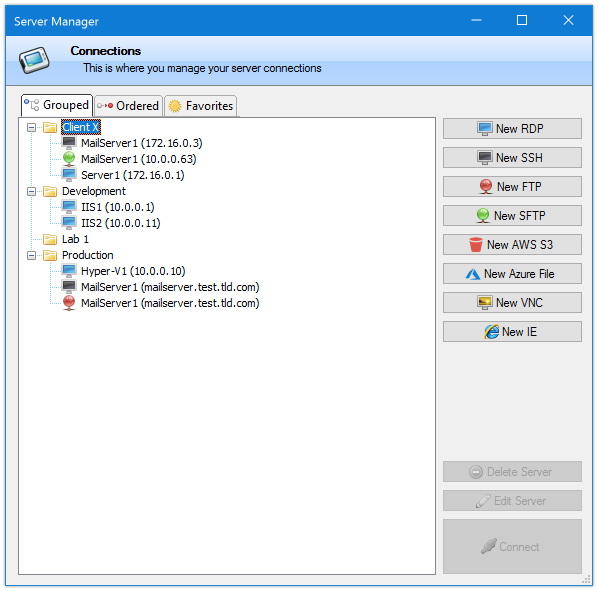
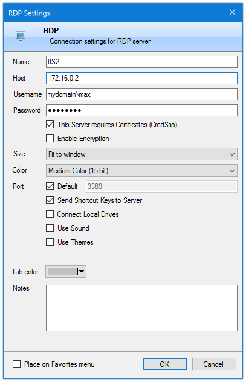
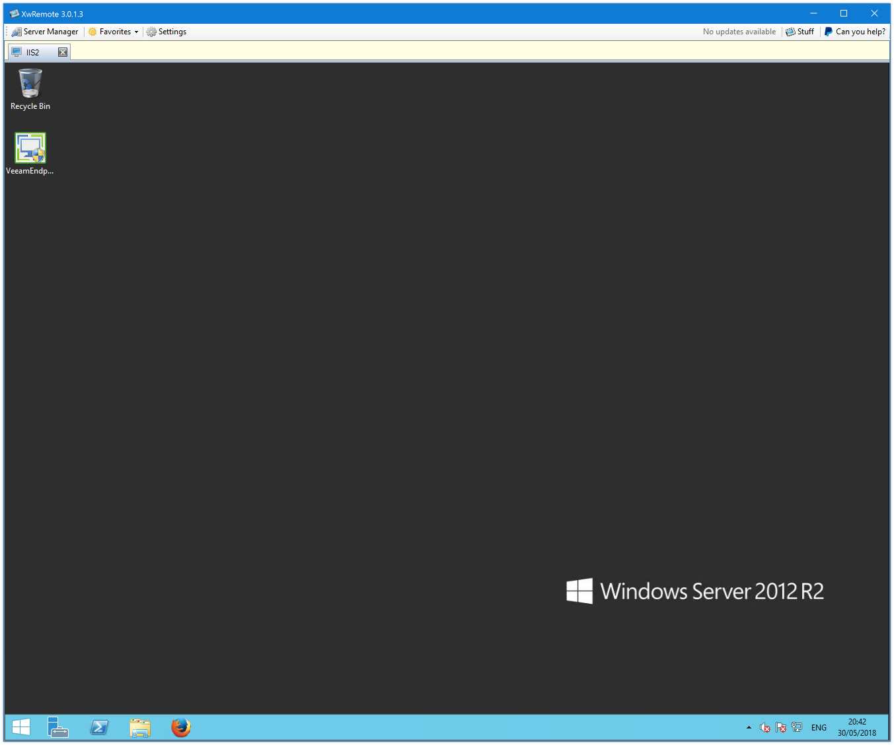
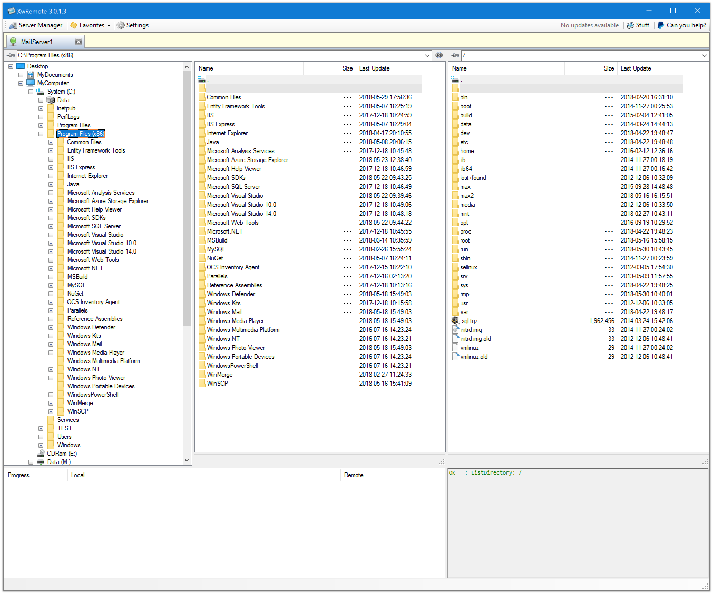
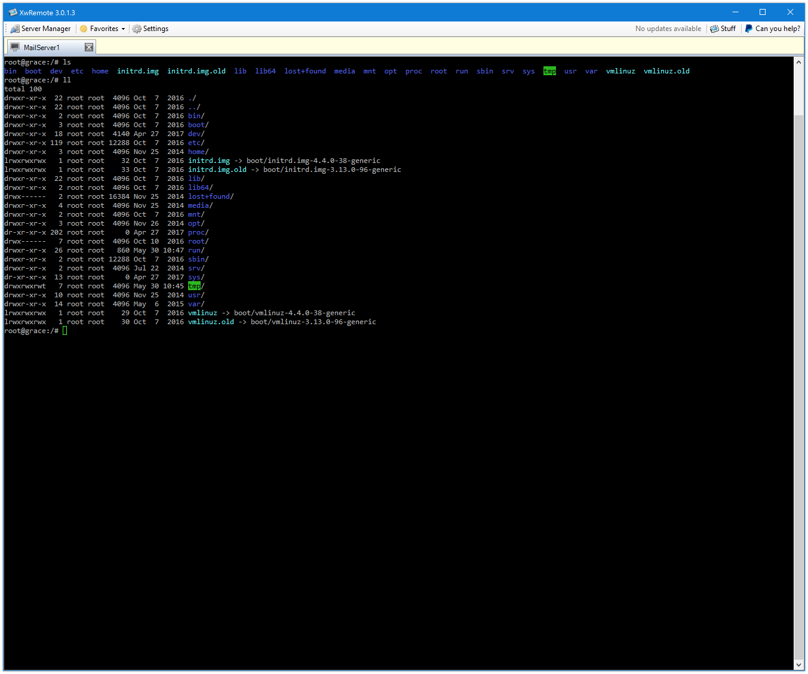

# XwRemote 

I am not the original author. I only forked the original author's code and added a sidebar in the style of MobaXterm. Therefore, I have retained the original author's donation link. If you like it, please continue to donate to the original author.

How do i eliminate the need for many applications and the consequent open and close merry-go-round?

##### For now it supports:
 - RDP 
 - SSH
 - FTP 
 - SFTP
 - AWS S3 Buckets
 - Azure File Storage
 - VNC 
 - IE(!)
 - Master password

The functionality is not the most complete but it will increase over time.
There is always a balance between "complete" and "simple" so...

I will try to include new features as time allows.

Anyway, if there is anything that this could do better, let me know!

##### Server Manager 

##### Example of server configuration (different configurations for different protocols) 

##### RDP session

##### SFTP connection (all file connectors use the same interface, FTP, SFTP, AWS S3, Azure)

##### Remote SSH session

